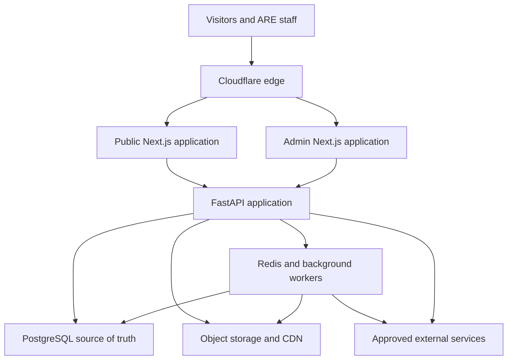
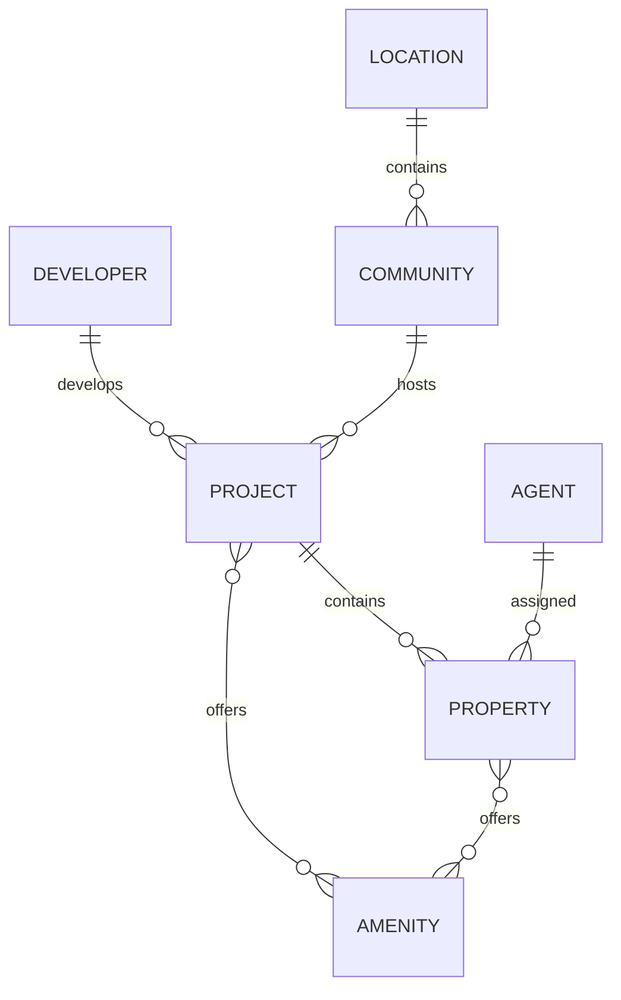
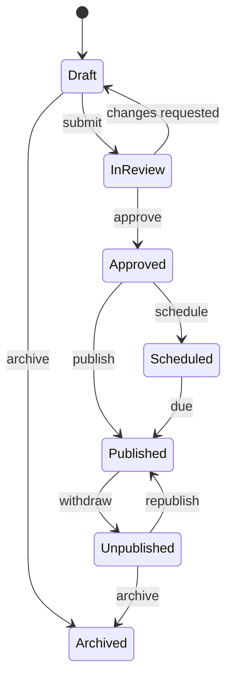
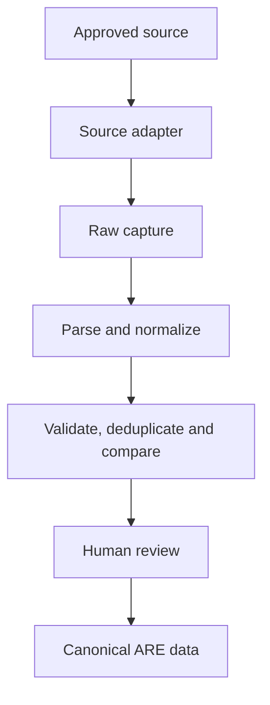
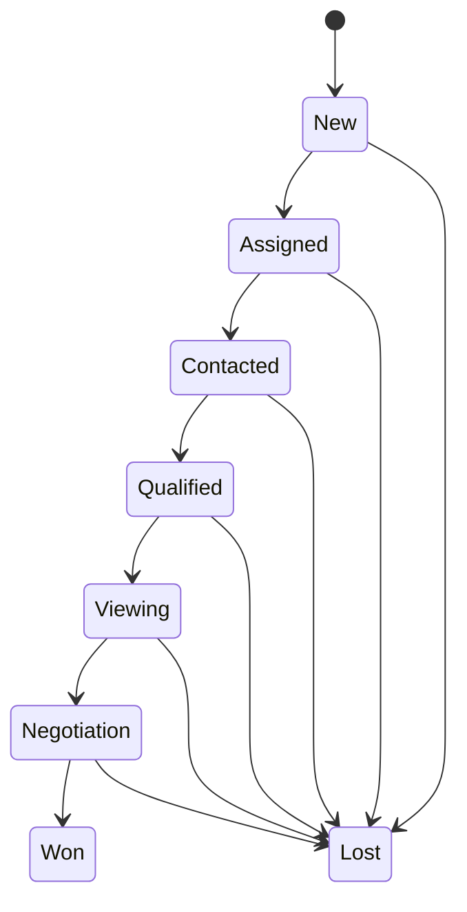
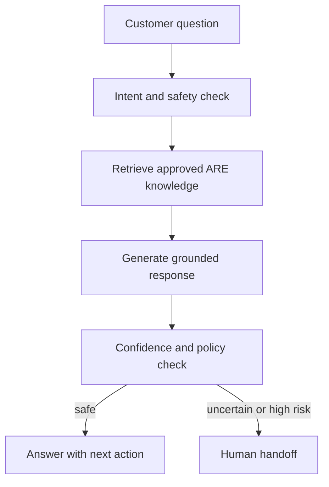
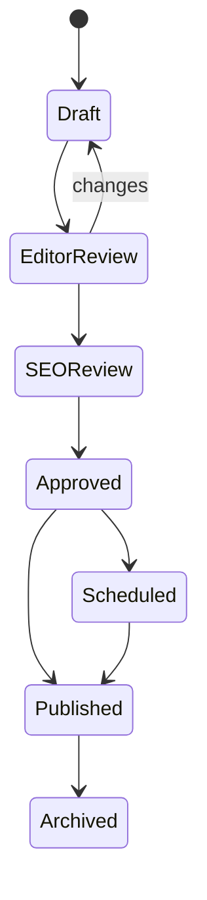

# ARE ARCHITECTURE BLUEPRINT v1.0

## ALIYAS Real Estate Digital Platform

| Document field | Value |
| --- | --- |
| Version | 1.0 |
| Status | Planning baseline — implementation requires approved, scoped tasks |
| Baseline date | 23 August 2026 |
| Product | ARE — ALIYAS Real Estate |
| Business context | ALIYAS Group of Companies; offices in Dubai and Ajman; UAE-wide real-estate operations |
| Primary audience | Owner, product, engineering, design, content, SEO, operations, security and compliance teams |
| Source inputs | Pasted markdown.md; Pasted markdown (2).md |

> ARE must be built as a data-driven real-estate platform, not as a collection of manually maintained web pages.

---

## 1. Document purpose and authority

This blueprint consolidates the supplied planning material into one coherent architecture baseline for the redesign and long-term development of the ALIYAS Real Estate platform.

It defines:

- Product scope and business outcomes.
- System boundaries and technical direction.
- Public website and administration capabilities.
- Core data domains and lifecycle rules.
- Data acquisition, AI, CRM, content, SEO and multilingual architecture.
- Security, privacy, performance, reliability and operational requirements.
- A dependency-aware delivery roadmap.
- Architecture decisions that still require owner approval.
- Governance, task, verification and Definition of Done rules.

This document is a planning authority, not blanket implementation approval. The repository and runtime environment have not been verified through these source files. Before implementation, the delivery agent must inspect the actual repository, identify conflicts, produce a current-state audit and obtain approval for the next bounded task.

If this blueprint conflicts with a later explicit owner decision, an approved Architecture Decision Record, verified repository constraints or an applicable legal/compliance requirement, the newer approved authority takes precedence and this document must be updated.

### 1.1 Requirement language

| Term | Meaning |
| --- | --- |
| MUST / MUST NOT | Binding baseline requirement unless formally superseded |
| SHOULD / SHOULD NOT | Recommended default; a deviation needs written justification |
| MAY | Optional capability that can be selected when justified |
| PENDING | An unresolved decision; implementation must not guess |
| FUTURE | Deliberately outside the current approved implementation scope |

### 1.2 Consolidation decisions

The two source inputs have been merged with the following rules:

1. Duplicate requirements appear once in their authoritative section.
2. Product requirements, architecture recommendations, implementation details and future ideas are kept separate.
3. The original high-level architecture is retained but expressed as clean logical boundaries.
4. The roadmap is corrected where a later phase depended on a capability scheduled after it.
5. Suggested technologies remain recommended defaults until repository audit and an architecture decision confirm them.
6. Ambiguous business rules are recorded as decisions to approve, not silently invented.

---

## 2. Executive summary

ARE is intended to become a premium UAE real-estate discovery, content, AI-assistance, data acquisition, SEO and lead-generation platform controlled through a centralized administration system.

The target platform is composed of:

- A fast, mobile-first public website.
- A secure administration platform.
- A canonical relational data platform.
- A controlled data acquisition and import engine.
- A grounded AI real-estate assistant.
- A lead and lightweight CRM layer.
- A content, multilingual and SEO engine.
- A media and document platform.
- A careers and recruitment system.
- Marketing, analytics, notification and attribution integrations.

The public website is the presentation layer. The Admin Platform is the operational control center. PostgreSQL-backed canonical data is the source of truth. External imports, AI output and translations are never allowed to become trusted public facts without the required validation and approval.

The recommended initial implementation style is a modular monolith: separate public and admin web applications backed by one well-structured FastAPI service, PostgreSQL, Redis-backed background workers and object storage. Domain boundaries must be clear enough to split services later, but microservices must not be introduced without a demonstrated scaling or organizational need.

---

## 3. Product vision, users and business outcomes

### 3.1 Product vision

ARE is not a brochure website. It is a digital operating platform that should:

- Present ARE as premium, trustworthy, modern and locally credible.
- Help buyers, tenants and investors discover relevant properties and projects.
- Turn high-intent website activity into qualified, attributable leads.
- Let human agents receive complete enquiry context and continue the conversation.
- Give administrators control over data, media, publishing, translations, SEO and operations.
- Reduce repetitive data entry through controlled ingestion and normalization.
- Grow organic visibility through structured content and strong technical SEO.
- Support UAE-wide growth without a major architectural rewrite.

### 3.2 Primary user groups

| User group | Primary needs |
| --- | --- |
| Buyer | Search, compare, understand and enquire about properties or projects |
| Tenant | Find rental inventory, understand location and contact an agent |
| Investor | Explore off-plan projects, locations, guides and verified investment information |
| Website visitor | Browse company, content, jobs and contact options in English or Arabic |
| ARE agent | Receive assigned leads, context, preferences and conversation history |
| Sales manager | Monitor, assign and progress leads; review conversion and team activity |
| Property/project manager | Maintain canonical listing and project information |
| Content/SEO team | Create, review, translate, optimize and publish content |
| Marketing team | Track acquisition, campaigns, events and conversions |
| HR | Publish jobs and securely process applications |
| Platform administrator | Manage access, configuration, workflows, imports, integrations and audit evidence |

### 3.3 Business outcomes

The platform MUST:

1. Support property sales, rentals, off-plan projects, developers, investment discovery and real-estate content.
2. Support thousands of projects, tens or hundreds of thousands of properties and large media libraries without a full rewrite.
3. Launch in English and Arabic, including correct right-to-left behavior.
4. Provide localized, indexable and SEO-safe URLs.
5. Centralize administration of data, workflows, media, users and settings.
6. Capture, qualify, attribute and route enquiries.
7. Ground AI answers in approved ARE information.
8. Preserve source, verification and change history for imported facts.
9. Protect private files and personal data.
10. Preserve valuable WordPress SEO equity during migration.

### 3.4 Success measures

Exact targets must be approved during discovery, but the measurement framework MUST include:

- Organic traffic and indexation quality.
- Search-to-detail and detail-to-enquiry conversion.
- Lead response, qualification and assignment performance.
- Data completeness, freshness, provenance and approval cycle time.
- Content and location-page performance.
- English and Arabic parity.
- Core Web Vitals and mobile performance.
- Platform availability, error rate and background-job reliability.
- Security events, access reviews, backup success and restore-test results.

---

## 4. Scope boundaries

### 4.1 In-scope platform capabilities

- Public property, project, developer, location and community discovery.
- Buy, rent, off-plan and investment journeys.
- Search, filters, sorting and pagination.
- Admin CRUD, workflow, preview, publishing and bulk operations.
- Canonical taxonomies, amenities and location hierarchy.
- Media, floor plans, brochures and approved documents.
- Source registry, ingestion, normalization, duplicate/conflict review and provenance.
- Lead capture, qualification, assignment, notes, conversation and attribution.
- AI knowledge retrieval, controlled Q&A, qualification and human handoff.
- Blog, news, market insights, guides, FAQs and static content.
- English/Arabic translation workflow, localized URLs and RTL.
- SEO metadata, structured data, sitemaps, redirects and internal linking.
- Careers, jobs, applications and protected CV storage.
- Marketing, analytics, transactional email and notification foundations.
- Security, RBAC, audit, monitoring, backups and disaster recovery.

### 4.2 Out of scope until separately approved

- Native mobile applications.
- Full transaction, conveyancing or escrow systems.
- Accounting or full ERP.
- Mortgage origination or processing.
- Property-purchase payment gateways.
- Blockchain or cryptocurrency capabilities.
- Unapproved data licensing or unrestricted scraping.
- Autonomous AI negotiation.
- Automated legal, mortgage, tax, investment or financial advice.
- High-compliance workflows without professional review.

### 4.3 Future-ready, not early implementation

The architecture may leave extension points for:

- Customer, agent and developer portals.
- Saved properties, saved searches and alerts.
- Viewing scheduling and calendar integrations.
- WhatsApp, SMS, push notifications and voice AI.
- Virtual tours, video calls and recommendation engines.
- Advanced investment analytics and mortgage integrations.
- Mobile apps and advanced semantic/OpenSearch capabilities.

These extensions MUST NOT distort or delay the approved core platform.

---

## 5. Architecture principles

### 5.1 Canonical data over hardcoded pages

Properties, projects, developers, locations, amenities, agents, content and SEO data MUST be served from approved backend records. Frontend components MUST NOT become a second source of business truth.

### 5.2 Admin as the control center

All material operational changes must be manageable through authorized administration workflows. Direct database edits and code changes are not acceptable routine content-management methods.

### 5.3 Separate facts, workflow and presentation

A record's business status, verification status and publication status are separate concerns. For example, a property may be verified but unpublished, or published while its current availability is unknown.

### 5.4 Stable facts and dynamic commercial data

Stable facts such as location, developer and approved project description may be published normally. Dynamic facts such as price, availability, payment-plan terms and handover estimates require source, effective date, verification and freshness controls.

If current data cannot be proven, the public experience SHOULD use:

- Ask for Price.
- Request Current Price.
- Request Latest Availability.
- Speak to an ARE Advisor.
- Enquire Now.

Stale data MUST NOT be presented as current.

### 5.5 Human authority over uncertain automation

AI, imports, translations, duplicate matching and internal-link suggestions assist humans. They do not silently publish, merge or make high-risk business claims.

### 5.6 Provenance and media rights by design

Every externally acquired material fact or asset must retain its source and rights context. Technical access does not create legal reuse rights.

### 5.7 Server-first and performance-conscious

The public website SHOULD use server rendering, pre-rendering and caching where appropriate, with minimal client JavaScript. Rich media must not compromise mobile usability or Core Web Vitals.

### 5.8 Secure and private by default

Least privilege, secure sessions, MFA for privileged access, input/file validation, secret management, protected storage, auditability and tested recovery are baseline requirements.

### 5.9 Progressive scale

Start with PostgreSQL search and pgvector where adequate. Add OpenSearch or other infrastructure only when measured scale or functionality justifies it.

### 5.10 Accessibility and localization are structural

WCAG 2.2 AA, English/Arabic parity and RTL behavior must be included in component, schema, URL and test design from the beginning, not bolted on at the end.

---

## 6. Quality attributes and non-functional requirements

| Attribute | Architectural requirement | Release evidence |
| --- | --- | --- |
| Performance | Server-first pages, optimized media, CDN, caching, indexes and minimal client JS | Mobile and slow-network tests; Core Web Vitals report |
| Scalability | Pagination, asynchronous processing, indexed relational queries and replaceable search boundary | Representative large-data tests and query plans |
| Security | MFA-ready privileged access, RBAC, validation, rate limits, secure files, secrets and audit | Threat review, access tests, security scan and manual verification |
| Privacy | Data minimization, consent, retention, deletion and restricted PII access | Approved data inventory and retention matrix |
| SEO | Stable localized URLs, metadata, hreflang, schema, redirects and crawl controls | SEO crawl, sitemap, canonical and redirect verification |
| Accessibility | WCAG 2.2 AA and reduced-motion/keyboard/screen-reader support | Automated checks plus manual keyboard and assistive review |
| Localization | English/Arabic parity, stored reviewed translations and full RTL | Locale parity checklist and Arabic QA |
| Data quality | Validation, provenance, freshness, duplicate/conflict review and audit | Import evidence and data-quality dashboard |
| Reliability | Timeouts, retries, idempotency, alerts, backups and restore tests | Failure-injection evidence and restore report |
| Maintainability | Typed contracts, modular boundaries, migrations, tests and ADRs | CI gates, architecture review and documentation |
| Observability | Correlated logs, metrics, traces, job health and alerting | Dashboard and alert-path verification |

Numeric SLOs, RPO, RTO, performance budgets and data-freshness limits are PENDING owner/architecture decisions and must be set before production readiness.

---

## 7. Logical system architecture



### 7.1 Container responsibilities

| Container/boundary | Responsibilities | Must not become |
| --- | --- | --- |
| Cloudflare edge | DNS, TLS, CDN, WAF, DDoS, rate/bot controls and edge caching | Business-data authority |
| Public web | SEO-safe presentation, discovery, search UX, localized rendering and enquiry entry | Store of hardcoded business records |
| Admin web | Authorized management, review, preview, dashboards and operations | Bypass around API authorization |
| FastAPI | Domain rules, validation, authorization, APIs, orchestration and audit hooks | Unstructured collection of unrelated endpoints |
| PostgreSQL | Canonical relational records, workflow state, provenance, audit references and search foundation | Dumping ground for ungoverned JSON |
| Redis | Cache, rate-limit state, queue coordination and temporary state | Durable source of truth |
| Background workers | Imports, media, translation, indexing, notifications, analytics and bulk work | Blocking path for normal web requests |
| Object storage/CDN | Original media, variants, documents and protected file objects | Public access to private files |
| External integrations | Maps, email, analytics, AI, authorized feeds and future communications | Uncontrolled alternate data authority |

### 7.2 Recommended application style

The initial backend SHOULD be a modular monolith with explicit domain modules, one migration history and one transactional data authority. This minimizes operational complexity while allowing later extraction of high-load components such as data acquisition, search, media processing or AI.

The public and admin experiences SHOULD be separate deployable applications or clearly separated application surfaces. The final choice depends on the repository audit and deployment constraints.

### 7.3 Primary runtime flows

#### Public read

1. The visitor requests a localized URL.
2. The edge serves safe cached content or forwards the request.
3. The public app fetches approved records through a server-side API path.
4. FastAPI enforces publication, locale and freshness rules.
5. The response is rendered with canonical, hreflang and structured metadata.

#### Admin write

1. An authenticated user opens an authorized admin module.
2. The UI calls a versioned API.
3. FastAPI validates permission, payload and state transition.
4. PostgreSQL commits the change transactionally.
5. An audit event records the actor and material before/after state.
6. Dependent cache/index/notification work is queued after commit.

#### Background job

1. The API or scheduler creates an idempotent job record.
2. A worker claims the job.
3. Retries use bounded backoff and do not duplicate committed effects.
4. Progress, warnings, errors and output counts are stored.
5. Admin users can inspect, retry or resolve failed work according to permission.

---

## 8. Recommended technology baseline

The following is a recommendation, not a substitute for repository inspection.

| Layer | Recommended baseline | Decision rule |
| --- | --- | --- |
| Public/admin frontend | Next.js 16.x or the stable patched release approved at implementation time; React 19.x; TypeScript; App Router; Server Components | Confirm compatibility and pin exact versions after audit |
| Styling/UI | Tailwind CSS and a lightweight accessible component system | Avoid unnecessary heavy frameworks |
| Backend | Python, FastAPI, Pydantic, SQLAlchemy and Alembic | Preserve typed contracts and migration discipline |
| Primary database | PostgreSQL | Relational modeling for core entities; JSONB only for genuinely flexible metadata |
| Cache/coordination | Redis | Never treat cached values as canonical |
| Workers | Celery plus Redis, or a justified reliable equivalent | Must support retries, idempotency, status and monitoring |
| Search | PostgreSQL full-text/indexed search initially | Add OpenSearch only after measured need |
| Vector retrieval | pgvector initially | Separate vector database requires evidence and approval |
| Data acquisition | Python, Playwright, HTTP clients, HTML parsers, structured-data/PDF extraction | Source-specific adapters and rights review are mandatory |
| Media | Object storage, CDN, image processing, AVIF/WebP and responsive variants | Large production media must not live on the app server |
| Edge | Cloudflare | DNS/CDN/WAF/DDoS/rate and bot protection |
| Deployment | Docker; Docker Compose for local; separate development, staging and production | Production topology remains an ADR |
| CI/CD | GitHub Actions or verified repository equivalent | Lint, type, test, migration and build gates |
| Testing | Pytest, API/integration tests, Vitest where useful and Playwright for critical journeys | Real dependencies for meaningful integration coverage |
| Monitoring | Structured logs, error tracking, uptime, metrics and worker/queue monitoring | Provider selection remains pending |

### 8.1 Technology exclusions by default

- No GraphQL unless REST cannot meet a demonstrated requirement.
- No separate vector database without measured need.
- No microservice split solely for fashion or hypothetical scale.
- No direct production media storage on application disks.
- No unreviewed third-party scripts on public pages.
- No hardcoded credentials, API keys or business records.

---

## 9. Domain architecture

| Domain | Core responsibility | Canonical authority |
| --- | --- | --- |
| Identity and access | Users, roles, permissions, sessions, MFA readiness and access review | Identity/RBAC tables and authorization service |
| Geography and taxonomy | UAE hierarchy, locations, communities, property types and amenities | Canonical taxonomy records |
| Developers and agents | Developer profiles, claims, agents, languages, specializations and assignments | Approved developer/agent records |
| Projects and properties | Inventory facts, relationships, availability, pricing snapshots and publication | Project/property domain |
| Media and documents | Assets, variants, rights, attribution, access and relationships | Media metadata plus object storage |
| Publishing workflow | Draft, review, approval, scheduling, publication and archive | Workflow state enforced by API |
| Data acquisition | Sources, adapters, raw capture, jobs, imports, normalization and change evidence | Raw/import records; never public authority directly |
| Leads/CRM | Enquiries, qualification, assignment, lifecycle, notes, consent and attribution | Lead domain |
| AI assistant | Grounded retrieval, intent, qualification, handoff and conversation context | Approved knowledge plus AI conversation records |
| Content and SEO | Articles, guides, FAQs, metadata, schema, redirects and internal links | Content and SEO records |
| Localization | Locales, translated values, glossary, review and localized slugs | Stored approved translation records |
| Careers | Jobs, applications, workflow and secure candidate files | Careers domain |
| Marketing/analytics | Event taxonomy, campaign context, conversions and integration delivery | First-party event/attribution records where retained |
| Notifications | Transactional email and future channel orchestration | Notification jobs and delivery evidence |
| Governance/audit | Settings, feature policy, ADR references and immutable material-action history | Audit/governance records |

Each domain MUST expose clear rules through application services. Cross-domain writes must be orchestrated intentionally and transactionally where consistency requires it.

---

## 10. Data architecture

### 10.1 Data modeling rules

- Use UUIDs or another approved non-guessable identifier strategy for internal identity.
- Give public records stable human-readable slugs and separate public references.
- Enforce foreign keys, unique constraints, check constraints and indexes in the database.
- Store creation, update and relevant effective timestamps consistently.
- Use soft-delete or archive only where retention, recovery or relationship history justifies it.
- Keep flexible source payloads and genuinely variable metadata in JSONB; keep queryable business fields relational.
- Do not overload one status column with availability, verification, workflow and publication meanings.
- Use migrations for every schema change and verify upgrade and rollback/forward-recovery behavior.
- Treat audit history and source provenance as first-class records, not free-text notes.

### 10.2 Core relationship model



This model is conceptual. Exact cardinality, ownership, historical behavior and deletion rules require an ERD and schema ADR before migration code is written.

### 10.3 Conceptual entity catalogue

| Cluster | Candidate entities |
| --- | --- |
| Identity | User, Role, Permission, RolePermission, UserRole, Session, MFAFactor, AccessReview |
| Geography | Country, Emirate, Location, Community, Landmark, GeoCoordinate |
| Taxonomy | PropertyType, ListingType, Amenity, ProjectType, StatusDefinition |
| People/business | Developer, Agent, Office, Team, AgentArea, AgentSpecialization |
| Inventory | Project, Property, ProjectPropertyType, Unit/Listing where required, AvailabilitySnapshot, PriceSnapshot, PaymentPlan, FAQ |
| Assets | MediaAsset, MediaVariant, Document, AssetRelationship, RightsRecord, Attribution |
| Workflow | ReviewRequest, Approval, Publication, ScheduledPublication, ChangeSet |
| Localization | Locale, LocalizedRecord, LocalizedSlug, TranslationJob, TranslationReview, GlossaryTerm |
| SEO | SEORecord, CanonicalRule, Redirect, SitemapEntry, StructuredDataOverride, InternalLinkSuggestion |
| Acquisition | Source, SourcePolicy, SourceAdapter, CrawlJob, RawRecord, ImportBatch, ImportCandidate, FieldProvenance, DuplicateCandidate, Conflict |
| CRM | Customer/Contact, Lead, LeadInterest, LeadEvent, Assignment, Note, Consent, AttributionTouch |
| AI | Conversation, Message, RetrievalReference, Intent, QualificationState, Handoff |
| Content | ContentItem, ContentType, Author, Category, Tag, ContentRelationship |
| Careers | Job, Application, CandidateDocument, RecruitmentEvent |
| Operations | BackgroundJob, Notification, DeliveryAttempt, IntegrationEvent, AuditEvent, SystemSetting |

Entity names are provisional. The ERD must decide whether concepts such as Customer and Contact, or MediaAsset and Document, are separate tables or typed variants.

### 10.4 Orthogonal state models

The source material mixes editorial state, availability and lifecycle status. The implementation MUST separate them.

| State axis | Candidate values | Purpose |
| --- | --- | --- |
| Verification | Unverified, Needs Review, Verified, Rejected, Stale | Whether the facts are trusted |
| Publication | Draft, In Review, Approved, Scheduled, Published, Unpublished, Archived | Whether and how a record is public |
| Property availability | Unknown, Available, Reserved/Under Offer, Sold, Rented, Unavailable | Commercial availability; final taxonomy PENDING |
| Project lifecycle | Upcoming, New Launch, Under Construction, Near Completion, Completed, Sold Out, Archived | Project market/build status |
| Record lifecycle | Active, Archived, Deleted where legally permitted | Administrative lifecycle |

A publication transition MUST validate verification state, required content, media rights, translation policy and dynamic-data freshness.

### 10.5 Pricing and availability model

Dynamic price or availability data SHOULD be modeled as time-bounded evidence rather than overwritten fields.

Each pricing record should support:

- Value or approved range.
- Currency and price basis.
- Related property/project/unit type.
- Source and source reference.
- Effective date.
- Captured, verified and last-updated timestamps.
- Verifier and verification state.
- Expiry or freshness deadline.
- Rights/public-display permission.
- Superseded state and historical relationship.

Public display is permitted only when a policy confirms that the data is verified, authorized and fresh. Otherwise the public page uses an enquiry CTA. The exact freshness windows and price-display policy are PENDING business approval.

### 10.6 Translation storage

Translations MUST be stored and versioned; they must not be generated on every request. The recommended relational design uses locale-keyed child records for translatable fields, including localized slug, content, review status and source version. A generic translation table MAY be used for low-risk flexible metadata, but must not weaken constraints or queryability.

Translation records should retain:

- Source locale and source revision.
- Target locale.
- Translation method: human, AI-assisted or imported.
- Glossary version.
- Review status, reviewer and timestamps.
- Publication status.
- Staleness when source content changes.

### 10.7 Provenance and change history

For imported or externally verified fields, retain:

- Source and source reference.
- Raw/original value where appropriate.
- Normalized canonical value.
- First seen, last seen and last verified.
- Confidence and verification status.
- Import batch and adapter version.
- Previous/new value and review decision when changed.

Merging duplicate records MUST preserve all surviving source references and an audit trail. Uncertain records must never be silently merged.

### 10.8 Data lifecycle



Permissions, required fields and audit events must be defined for every transition. Imported data begins outside this canonical publishing lifecycle until an authorized import decision accepts it.

---

## 11. Public website architecture

### 11.1 Information architecture

| Navigation group | Pages/entries |
| --- | --- |
| Buy | Properties for Sale, Apartments, Villas, Townhouses, Penthouses, Luxury, Commercial, Investment |
| Rent | Apartments, Villas, Townhouses, Commercial |
| Off-Plan | All Projects, New Launches, Upcoming Projects, Developers, Communities |
| Locations | Dubai, Ajman, other approved UAE locations and Communities |
| Investment | Investment Guides, Market Insights, ROI/investment information and Off-plan Investment |
| Content | Blog, Market Insights, Real Estate News, Area Guides and Investment Guides |
| Company | About ARE, Agents, Careers, Contact and Offices |

The final navigation must be validated against real inventory, content ownership and mobile usability. Empty categories SHOULD NOT be exposed merely because they exist in the architecture.

### 11.2 Homepage

Candidate homepage sections:

1. Hero and primary value proposition.
2. Main property/project search.
3. Buy, Rent and Off-Plan entry points.
4. Featured projects.
5. Featured properties.
6. Developer ecosystem.
7. Popular communities.
8. Approved investment opportunities.
9. Why ARE.
10. Market insights and latest articles.
11. AI assistant CTA.
12. Lead/enquiry CTA.
13. Careers.
14. Contact and offices.
15. Footer with legal, locale and navigation links.

The homepage must use explicit performance budgets. Below-the-fold media should be lazy-loaded, responsive variants should be selected correctly and decorative animation must respect reduced-motion preferences.

### 11.3 Core public templates

| Template | Required capability |
| --- | --- |
| Property listing | Query, filters, sort, pagination, result count, empty state, localized cards and index-control policy |
| Property detail | Approved facts, media, map/location, amenities, agent, related content and enquiry CTA |
| Project listing/detail | Developer, lifecycle, location, property types, size ranges, approved handover/payment data, media, documents, FAQs and enquiry |
| Developer profile | Approved description, logo/media rights, projects, communities, SEO and relationship disclaimer where required |
| Location/community | Overview, properties, projects, developers, guides, FAQs, map, nearby areas and localized SEO |
| Agent profile | Approved profile, languages, areas, specialization, status and contact route |
| Content detail | Author, dates, relationships, metadata, schema and locale |
| Careers/job detail | Open roles, job details and secure application journey |
| Contact | General, property, project, investment, developer, career and agent enquiries |

### 11.4 Property detail data

The public/API model may expose:

- Public reference, title and localized slug.
- Property/listing type and approved status.
- Developer, project, community and location.
- Bedrooms, bathrooms, area and approved features.
- Amenities, description, gallery, video and floor plan.
- Coordinates and nearby landmarks.
- Assigned active agent.
- Verification/publication freshness where useful.
- SEO, translation and timestamps.

Internal reference, restricted source details, private notes and non-public evidence MUST remain private.

### 11.5 Project detail data

The project experience may expose:

- Project name, developer, location/community and coordinates.
- Project lifecycle and type.
- Property types, bedroom and size ranges.
- Verified handover and payment-plan information when authorized.
- Amenities, master plan, floor plans, gallery and video.
- Approved brochure/documents.
- FAQs and related projects/properties.
- Localized content, SEO and structured data.

Developer partnership or registration claims MUST NOT be shown unless ARE is authorized to make them.

### 11.6 Search and filters

Search must support, as data permits:

- Text and public reference.
- Sale/rent and project/property distinction.
- Location and community.
- Developer and project.
- Property type.
- Bedrooms.
- Amenities.
- Price only when the approved pricing model permits it.
- Relevance, newest and other approved sorts.

Filters must produce deterministic URLs. Uncontrolled combinations must not create infinite indexable URL spaces. Prefer pagination; use infinite scrolling only when it improves usability and retains accessible navigation, URL state and crawl behavior.

### 11.7 Contact and conversion

All relevant forms should enter one centralized lead-processing boundary. Each submission must retain its page, entity, locale, campaign context and consent evidence. Public forms require validation, abuse controls, accessible errors, confirmation and safe retry/idempotency behavior.

---

## 12. Administration platform

### 12.1 Module map

- Dashboard.
- Properties.
- Projects.
- Developers.
- Locations and Communities.
- Taxonomies and Amenities.
- Agents, Leads and Customers/Contacts.
- AI Assistant.
- Content and SEO.
- Media and Documents.
- Data Sources, Jobs and Imports.
- Translations and Glossary.
- Careers and Applications.
- Marketing, Analytics and Attribution.
- Notifications.
- Users, Roles and Permissions.
- Audit Logs.
- Settings and Integration Health.

### 12.2 Standard management capabilities

Entity modules should consistently support, where authorized:

- List, search, filter, sort and paginate.
- Create and edit with server-side validation.
- Duplicate only when it cannot duplicate protected identity or provenance.
- Preview without public publication.
- Submit, review, approve, publish, unpublish and archive.
- View related records, source history and audit activity.
- Bulk operations with preview, permission checks, job status and rollback/recovery strategy.

Property bulk actions may include publish/unpublish, agent assignment, location/amenity updates, media operations and archive. Bulk changes must never bypass per-record invariants.

### 12.3 Dashboard

The dashboard may include:

- New, unassigned and aging leads.
- AI-originated leads and handoff status.
- Enquiries, views and conversion metrics.
- Top properties, projects, locations and content.
- Traffic and organic acquisition summaries.
- Job applications.
- Import, translation, media and indexing jobs.
- Stale data, rights issues and review queues.
- System, integration, worker, storage and security alerts.

Every metric requires a documented definition, source, time zone and access policy. Dashboard numbers must not be computed differently from exported/reporting values.

### 12.4 Agent management

Agent records may include name, approved photo, languages, service areas, specialization, contact channels, assigned properties/projects, lead assignments and active status. Agent access to leads must be enforced through RBAC and assignment/management rules.

---

## 13. Data acquisition and import engine

### 13.1 Trust boundary

External data is untrusted input. It must enter a raw/import boundary and cannot write directly to canonical published tables.



### 13.2 Source registry

Each source should record:

- Name, URL, type and owner/contact.
- Access method: API, feed, import or crawler.
- Allowed fields and media/document rights.
- Crawl/import schedule and rate limits.
- Priority and source-risk classification.
- Terms, robots and reuse assessment.
- Adapter and parser version.
- Last run, success, failure and error details.
- Review notes and enabled/disabled state.

Suggested internal risk meaning:

| Risk | Meaning |
| --- | --- |
| Green | Official/authorized source with documented permitted use |
| Yellow | Some facts may be usable, but field/media/terms review is required |
| Red | Insufficient rights, prohibited use or unacceptable risk; ingestion/publication disabled |

This classification supports governance and does not replace legal review.

### 13.3 Source adapters

Each source must have an isolated adapter with:

- Explicit input/output contract.
- Rate, timeout and retry policy.
- Authentication/secret handling.
- Raw-response retention policy.
- Parser tests based on permitted fixtures.
- Versioning and change detection.
- Disable switch and health status.

One source's markup or API change must not break unrelated adapters.

### 13.4 Job lifecycle and evidence

Supported job states:

- Queued.
- Running.
- Completed.
- Partial.
- Failed.
- Needs Review.
- Cancelled.

Track URLs/items scanned, records found, new/updated candidates, duplicate candidates, conflicts, files, warnings, errors, start/end time and adapter version.

### 13.5 Import preview

Before canonical commit, an authorized user must see:

- New records.
- Proposed field updates.
- Duplicate candidates and match confidence.
- Conflicts.
- Missing/invalid fields.
- Source changes.
- Media/document rights state.
- Records that will be skipped.

Approval, partial approval, rejection and defer decisions require audit evidence.

### 13.6 Normalization

Canonical mapping is required for developer names, project names, locations, communities, property types, amenities and statuses. Aliases such as “Dubai Marina”, “Dubai Marina, Dubai” and “Dubai Marina Area” should resolve to one approved location without losing the original source value.

### 13.7 Duplicate and conflict handling

Candidate matching may use project name, developer, location, coordinates, address, source reference and similarity signals. Human decisions include merge, keep separate, ignore and review later. Auto-match rules may identify obvious exact identities, but uncertain merges are prohibited.

### 13.8 Change detection

When a source value changes, preserve previous value, proposed value, source, timestamp, confidence and review state. High-risk fields such as price, handover, payment plan and availability should receive stricter freshness and approval rules.

### 13.9 Legal and rights rule

Public accessibility and technical scrapeability do not establish the right to reuse content. Prefer official developer information, authorized feeds, licensed assets and factual fields whose use has been approved. Do not republish third-party editorial text, branding, logos, images or documents without appropriate authorization.

---

## 14. Search architecture

### 14.1 Initial strategy

Use PostgreSQL indexes and full-text capability first. Search logic should live behind a service contract so it can later use OpenSearch without changing public URLs or domain rules.

### 14.2 Index document

A search document may include:

- Entity identity and type.
- Locale and localized title.
- Publication and verification eligibility.
- Listing type and property type.
- Developer, project, emirate, location and community.
- Bedrooms, amenities and approved searchable ranges.
- Coordinates where geospatial search is approved.
- Relevance signals and freshness.

Only public, authorized records may enter the public index.

### 14.3 OpenSearch adoption gate

OpenSearch should be evaluated only when one or more measured conditions exist:

- PostgreSQL cannot meet approved latency under representative load.
- Advanced faceting, typo tolerance, ranking or multilingual analysis is inadequate.
- Index volume/refresh behavior harms the transactional database.
- Search operational ownership and cost are approved.

### 14.4 Vector retrieval

pgvector is the recommended initial store for AI retrieval embeddings. Embeddings must reference an approved source revision and be invalidated/rebuilt when that source changes or becomes unpublished.

---

## 15. Leads and CRM

### 15.1 Lead lifecycle



Transitions, required notes and loss reasons must be approved. Reassignment and reopening rules must be explicit.

### 15.2 Lead record

A lead may contain:

- Lead ID and created/updated timestamps.
- Name, phone, email and preferred language.
- Consent type, text/version, timestamp and acquisition method.
- Intent: property, project, rent, buy, off-plan, investment or other.
- Related property/project/developer/location.
- Bedrooms, budget range, timeline and preferred location if volunteered.
- Source, landing page, referrer and UTM data.
- Assigned agent/team, status and SLA timestamps.
- Qualification, conversation reference and notes.
- Lost reason or won outcome.

Sensitive data must be minimized and access-controlled. Free-text notes must not become an uncontrolled repository for unnecessary personal data.

### 15.3 Assignment and handoff

Assignment policy may consider active status, location, specialization, language, workload and management override. The exact routing algorithm is PENDING. Every automated assignment must be visible, explainable and auditable.

### 15.4 Attribution

Store acquisition context with the lead rather than relying only on third-party analytics. The model should support first touch, lead-creation touch and, if approved, multi-touch history.

Example journey:

Google Organic → Project page → AI conversation → Qualified lead → Agent

---

## 16. AI assistant architecture

### 16.1 Role

AI is an assistant, not a replacement for ARE agents. It may:

- Greet and identify intent.
- Answer approved factual questions.
- Search approved properties, projects and content.
- Ask relevant qualification questions.
- Collect appropriate contact details and consent.
- Create/update a lead through an authorized tool.
- Escalate and preserve context for a human agent.

Human agents retain authority for current price/availability confirmation, negotiation, viewings, sales advice and closing.

### 16.2 Knowledge boundary

The retrieval knowledge base may include only eligible revisions of:

- Projects and properties.
- Developers, locations and communities.
- FAQs.
- Approved articles and guides.
- Approved company information.

Draft, rejected, stale, expired, private or rights-restricted material must not be retrievable for public answers.

### 16.3 Grounded answer flow



### 16.4 Non-negotiable guardrails

AI MUST NOT invent or imply certainty about:

- Current price or availability.
- Handover dates or payment plans.
- Amenities or developer claims.
- Legal, tax, mortgage, investment-return or financial advice.
- ARE partnerships or authorization.

When evidence is missing, conflicting or stale, AI must state the limitation and offer human assistance. Model memory is not an acceptable authority for transactional real-estate facts.

### 16.5 Human handoff triggers

- Current price or availability request.
- Negotiation or viewing request.
- Complex financial, mortgage, legal or compliance question.
- Explicit request for a person.
- Missing/conflicting evidence.
- High-intent qualified lead.
- User distress, complaint or safety concern under an approved support policy.

### 16.6 Conversation record

Where policy permits, store conversation ID, lead/contact relationship, language, messages, timestamps, intent, retrieved record references and revisions, qualification state, consent and handoff state.

Retention, deletion, redaction, staff access and model-provider data handling MUST be approved before production.

### 16.7 AI operational controls

- Tool allow-list and least privilege.
- Prompt and policy versioning.
- Retrieval citations to internal record/revision IDs.
- Evaluation set for factuality, refusal and handoff.
- Cost, latency, error and escalation monitoring.
- Protection against prompt injection in imported/content data.
- Immediate disable switch.
- No autonomous publishing or negotiation.

### 16.8 Dependency rule

AI qualification and lead handoff cannot be considered complete until a minimal CRM/Lead authority, consent model, assignment path and agent conversation view exist. This corrects the original roadmap ordering.

---

## 17. Content and SEO platform

### 17.1 Content types

- Blog.
- Market Insights.
- Real Estate News.
- Area Guides.
- Investment Guides.
- Developer Guides.
- Project Guides.
- FAQs.
- Static pages.

### 17.2 Content fields

Content should support title, localized slug, body, excerpt, author, category, tags, featured image, related projects/properties/locations, SEO title, meta description, canonical policy, Open Graph data, structured data eligibility, publication/updated dates, locale and workflow status.

### 17.3 Editorial workflow



Roles, segregation of duties and emergency unpublish behavior must be defined.

### 17.4 SEO engine

The platform must support:

- Dynamic metadata.
- Canonical URLs.
- Hreflang.
- XML sitemaps.
- Robots.txt.
- Breadcrumbs.
- Structured data.
- Redirect management.
- Index/noindex controls.
- Open Graph/social metadata.
- Image alt text and media SEO.
- Internal linking with human-reviewable suggestions.

### 17.5 URL architecture

Baseline examples:

- /en/ and /ar/
- /en/properties
- /en/properties/dubai
- /en/properties/dubai-marina
- /en/projects
- /en/projects/{project-slug}
- /en/developers/{developer-slug}
- /en/locations/{location-slug}
- /en/blog/{article-slug}
- Arabic equivalents under /ar/

Exact paths, pluralization, nested-location strategy and canonical domain are PENDING early approval. Once public and indexed, URL changes require redirects and SEO review.

### 17.6 Structured data

Potential accurate schemas include Organization, WebSite, BreadcrumbList, Article, eligible FAQPage and RealEstateAgent where appropriate. Structured data must match visible facts and search-engine eligibility. Misleading or unsupported schema is prohibited.

### 17.7 Internal relationships

The platform should support:

- Project → Developer, Location and Related Projects.
- Property → Project and Community.
- Article → Project, Property, Location or Guide.
- Location → Nearby Areas, Properties, Projects and Guides.

Automated suggestions remain editable and do not publish automatically.

---

## 18. Multilingual and Arabic RTL

### 18.1 Launch locales

- English.
- Arabic.

The architecture must allow future locales without redesigning entity identity, routing or publication workflows.

### 18.2 Locale selection

On a first visit to the root, browser language may select /ar/ for Arabic and /en/ for English or unsupported languages. Explicit user choice must persist and take precedence over repeated detection. Search bots, shared URLs and deep links must not be unpredictably redirected.

### 18.3 Translation workflow

English source → AI-assisted translation if approved → glossary validation → human review → stored revision → publication → cache/index refresh

Source edits must mark affected translations stale. Translation jobs need progress, errors and retry behavior.

### 18.4 Terminology glossary

Maintain approved translations for terms such as:

- Off-plan.
- Handover.
- Developer.
- Payment plan.
- Community.
- Freehold.
- Investment.
- Residence.

### 18.5 RTL requirements

Arabic is a complete interface mode, not string replacement. It requires:

- Correct dir="rtl" behavior.
- Arabic typography and spacing.
- Mirrored directional controls where appropriate.
- Safe mixed Arabic/English, number and currency rendering.
- RTL-aware forms, validation, tables, filters, maps and dialogs.
- Keyboard, screen-reader and reduced-motion parity.

---

## 19. Media, documents and maps

### 19.1 Media catalogue

Support images, video, floor plans, master plans, brochures, agent images, blog assets and career documents.

Track:

- Source and owner.
- Rights/license status and evidence.
- Required attribution.
- Original file identity and checksum.
- MIME type, size and dimensions/duration.
- Related entities.
- Upload/capture date and version.
- Processing state and generated variants.
- Public/private access level.
- Retention and archive state.

### 19.2 Rights hierarchy

1. ARE-owned.
2. Developer-authorized.
3. Licensed.
4. Other documented permission.

The appearance of an asset on another real-estate website does not grant ARE reuse rights. Rights-expired or disputed assets must be removable from public delivery without deleting required evidence.

### 19.3 Image processing

Generate responsive sizes and approved AVIF/WebP variants asynchronously. Preserve an original where policy permits, validate metadata and prevent decompression or processing abuse. Alt text is localized content, not automatically derived from filenames.

### 19.4 Document security

CVs, internal reports, restricted brochures and private documents must not use uncontrolled public URLs. Use private object storage, short-lived authorized access, content-type validation, size limits, malware-scanning strategy and audited download rules.

### 19.5 Maps

Store latitude, longitude, approved address, community and nearby landmarks. Map provider keys must be secret/configured, domain-restricted where possible and never hardcoded. Provider, cost, geocoding terms and fallback behavior are PENDING.

---

## 20. Careers, marketing, communications and notifications

### 20.1 Careers

Job fields may include title, department, location, employment type, description, responsibilities, requirements, benefits, closing date and status.

Application fields may include name, email, phone, CV, cover letter and only other approved fields. Recruitment states may include New, Reviewed, Shortlisted, Interview, Selected and Rejected.

Candidate data and CVs are private. Access, retention, deletion and communication rules must be approved before launch.

### 20.2 Marketing integrations

Potential integrations:

- GA4, Search Console and Google Ads.
- Meta Pixel and Conversions API.
- LinkedIn Insight Tag and conversion tracking.

No integration may be enabled without configuration ownership, consent/privacy review, environment separation and failure monitoring.

### 20.3 Analytics event taxonomy

Candidate events:

- Search.
- Property/project view.
- Gallery interaction.
- Floor plan view.
- Brochure request.
- Ask for Price.
- Request Availability.
- WhatsApp, call or agent-contact click.
- Form submission.
- AI conversation and AI-qualified lead.
- Career application.

Each event needs a stable name, purpose, trigger, parameters, data classification and owner. Client and server events must avoid double counting.

### 20.4 Transactional email

Use a proper transactional email service for lead confirmation, agent notification, career application, password reset, workflow alerts and import/translation completion or failure.

Email delivery must support:

- Template versioning and locale.
- Queueing, retry and dead-letter/failure visibility.
- Provider message ID and delivery status.
- Suppression/bounce handling.
- Secret management and domain authentication.
- No unnecessary sensitive data in email content.

### 20.5 Future communication channels

WhatsApp, SMS and other channels may later attach to centralized lead/customer records. Channel integrations must preserve consent, identity, timeline and audit context rather than creating isolated conversation silos.

---

## 21. API and integration architecture

### 21.1 API style

The initial API SHOULD use REST with FastAPI. The contract must support:

- Explicit versioning.
- Authentication and authorization.
- Pydantic request/response validation.
- Consistent error envelopes.
- Pagination, filtering, sorting and search.
- Request/correlation IDs.
- Rate limits by risk and actor.
- Idempotency for retryable create/action endpoints.
- Optimistic concurrency or version checks where lost updates are possible.
- Structured logging and metrics.
- OpenAPI documentation restricted appropriately for each environment.

GraphQL is not required for the initial architecture.

### 21.2 Public and admin contracts

Public read models should expose only approved, published, locale-eligible and rights-safe fields. Admin models may expose workflow, provenance and internal metadata according to permission. Reusing an unrestricted admin schema as a public response is prohibited.

### 21.3 Error model

Errors should provide:

- Stable machine-readable code.
- Safe human-readable message.
- Field-level validation details where appropriate.
- Correlation ID.
- Retry guidance when safe.

Responses and logs must not expose secrets, stack traces, private source payloads or personal data.

### 21.4 Integration pattern

External calls require timeout, bounded retry, circuit/failure handling, secret ownership and observable delivery state. Webhooks should be signed and replay-protected where supported. Provider callbacks must be idempotent.

Third-party failures must not corrupt canonical transactions. Prefer an outbox/durable job pattern for post-commit delivery such as notification, indexing and analytics forwarding.

### 21.5 Configuration

Configuration must be validated at startup and separated by environment. API keys, passwords, database credentials, OAuth/AI/cloud secrets and signing keys must never be committed or hardcoded.

---

## 22. Security, RBAC, audit and privacy

### 22.1 Security baseline

Minimum controls:

- HTTPS everywhere.
- Secure authentication and session lifecycle.
- MFA for privileged users.
- Least-privilege RBAC.
- CSRF protection where cookie-based sessions are used.
- Input validation and context-appropriate output encoding.
- Rate limiting and abuse/bot controls.
- Security headers and restrictive browser policies.
- Safe file upload validation and protected file access.
- Central secret management and rotation process.
- Dependency and container scanning.
- Structured security monitoring and incident response.
- Automated backups and tested restoration.
- Environment separation and production access control.

### 22.2 Threat surfaces

Security review must explicitly consider:

- Public forms, login and password reset.
- Admin privilege escalation.
- Broken object-level authorization.
- Property/content publishing actions.
- Bulk actions and exports.
- File upload, processing and download.
- Data ingestion and parser attacks.
- AI prompt injection, tool misuse and data leakage.
- Third-party scripts, webhooks and API integrations.
- Cache poisoning and accidental private-response caching.
- Personal data in logs, analytics and notification payloads.

### 22.3 RBAC model

Candidate roles:

- Super Admin.
- Admin.
- Property Manager.
- Sales Manager.
- Agent.
- Marketing.
- Content Manager.
- SEO Manager.
- HR.
- AI Manager.

Roles are bundles; permissions are the enforceable authority. Candidate permission naming:

- property.read, property.create, property.update, property.publish.
- project.read, project.create, project.update, project.publish.
- lead.read, lead.assign, lead.update.
- content.create, content.review, content.publish.
- ai.read, ai.manage.
- seo.manage, media.manage, users.manage.

The exact permission catalogue and role grants are PENDING. Every protected API action must check permission server-side. Hiding an admin button is not authorization.

### 22.4 Sensitive-action controls

High-risk actions should require one or more of:

- Recent authentication/MFA.
- Separate publish/approve permission.
- Confirmation with affected-record count.
- Reason/comment.
- Four-eyes approval where approved.
- Immutable audit event.

Examples include role changes, bulk publication, destructive archive/delete, source-rights changes, private-file access and integration-secret rotation.

### 22.5 Audit logging

Audit material actions such as:

- Record create/edit/approve/publish/archive.
- Lead view/assignment/status changes where required.
- Role and permission changes.
- Source and reuse-policy changes.
- Translation/content approval.
- Import/merge decisions.
- Private-file access.
- AI configuration or knowledge eligibility changes.

An audit event should contain actor, action, timestamp, target, action type, material before/after values, request/correlation ID and relevant outcome. Sensitive values must be masked. Audit records need retention and tamper-resistance policy.

### 22.6 Privacy architecture

Before production, create and approve:

- Personal-data inventory and data-flow map.
- Purpose/legal-basis and consent matrix.
- Retention schedule by record type.
- Access matrix.
- Correction, deletion and restriction processes.
- Incident response and breach escalation.
- Processor/provider inventory and data-location review.
- AI conversation and analytics privacy rules.
- Candidate/CV handling rules.

UAE privacy and data-protection obligations must be reviewed by appropriate legal/compliance professionals. This blueprint does not substitute for that review.

### 22.7 Logging and privacy

Logs, traces and analytics must exclude or mask credentials, tokens, CV content, message bodies and unnecessary phone/email data. Access to production observability data must itself be controlled and audited.

---

## 23. Performance, scale and asynchronous processing

### 23.1 Public performance strategy

- Prefer Server Components and server rendering.
- Pre-render stable content where invalidation can be controlled.
- Cache public reads by locale and publication revision.
- Use responsive images, AVIF/WebP and CDN delivery.
- Lazy-load non-critical media and widgets.
- Avoid excessive third-party JavaScript.
- Use database and search indexes based on measured queries.
- Paginate large results and admin tables.
- Stream only where it improves perceived performance.
- Preserve layout dimensions to control visual shift.

The project must set enforceable route-level budgets for JavaScript, images, fonts, server response and Core Web Vitals before the public foundation is accepted.

### 23.2 Scale assumptions

Design for growth from dozens to thousands of projects and from hundreds to tens/hundreds of thousands of properties. Test using representative relationships, locales and media metadata—not empty-table benchmarks.

### 23.3 Cache policy

Every cache needs:

- Key and locale/tenant-free scope definition.
- TTL or event-driven invalidation.
- Publication/permission safety.
- Stampede protection where needed.
- Fallback behavior.
- Metrics.

Private/admin responses must never enter public caches.

### 23.4 Background operations

Required asynchronous categories:

- Crawling and imports.
- Image/media processing.
- Translation.
- AI embedding/indexing.
- Sitemap generation.
- Notifications.
- Analytics processing.
- Bulk admin operations.

Every job needs state, progress, safe retry, idempotency, timeout, cancellation policy, error evidence and admin visibility. Poison jobs require a dead-letter or equivalent investigation path.

### 23.5 Error handling

No subsystem may fail silently. Define timeouts, failure states, retry limits, user-visible recovery, alerts and runbooks. Retrying must not duplicate leads, notifications, imports or payments if future payment functionality is ever approved.

---

## 24. Observability, reliability and disaster recovery

### 24.1 Observability

Monitor:

- Frontend and backend errors.
- API latency, throughput and status distribution.
- Database connections, slow queries and storage.
- Redis, worker and queue health.
- Search latency/index freshness.
- Object storage and media-processing failures.
- AI latency, cost, retrieval failure and handoff rate.
- Email/integration delivery.
- Scheduled job success and data freshness.
- Core customer-journey synthetic checks.

Use correlated structured logs and environment/service/release identifiers. Alerts must have an owner, severity, notification route and runbook.

### 24.2 Database recovery

- Automated, encrypted backups.
- Defined retention.
- Point-in-time recovery where supported.
- Off-system or failure-domain-aware storage.
- Scheduled restore tests.
- Migration recovery and bad-deployment runbook.

### 24.3 Media recovery

Use durable object storage, appropriate redundancy and versioning where useful. Database backups and object storage must be recoverable to a mutually consistent point or have a documented reconciliation procedure.

### 24.4 Recovery scenarios

Runbooks are required for:

- Database failure or corruption.
- Object-storage failure or accidental deletion.
- Redis/queue outage.
- Worker backlog.
- Bad deployment or migration.
- Search/index loss.
- Third-party integration outage.
- Security incident.
- DNS/CDN failure.

RPO and RTO values are PENDING and must be approved before production readiness.

---

## 25. Environments, CI/CD and deployment

### 25.1 Environment separation

Maintain separate development, staging and production environments. Production secrets and personal data must not be used in development. Test/staging seed data must be synthetic or properly anonymized.

### 25.2 Local development

The approved local environment should be reproducible with documented prerequisites and containerized dependencies. It should include PostgreSQL, Redis and safe local equivalents for object storage, email and external integrations where practical.

### 25.3 Continuous integration gates

Applicable gates:

1. Formatting and lint.
2. Type checks.
3. Unit tests.
4. Database migration validation.
5. Backend/API integration tests.
6. Frontend build and component tests.
7. Targeted Playwright critical journeys.
8. Dependency/security checks.
9. Artifact/container build.

No failing gate may be ignored without an explicit time-bounded owner-approved exception.

### 25.4 Deployment requirements

- Immutable versioned artifacts.
- Environment-specific configuration.
- Pre-deployment migration plan.
- Health/readiness checks.
- Controlled rollout.
- Post-deployment smoke tests.
- Rollback or forward-recovery plan.
- Release notes and audit/reference to approved tasks.

The exact hosting topology, regions, deployment strategy and platform providers remain PENDING.

---

## 26. WordPress migration and SEO preservation

Migration discovery begins in Phase 0 even though final cutover occurs near launch.

### 26.1 Discovery inventory

1. Crawl the current website.
2. Export all reachable and known URLs.
3. Identify indexed and high-value pages.
4. Capture metadata, canonicals, headings and structured data.
5. Identify useful, current and owner-approved content.
6. Classify media rights.
7. Capture backlinks and traffic indicators where available.

### 26.2 Migration mapping

For every legacy URL, decide:

- Preserve the URL.
- Map to an equivalent localized new URL.
- Consolidate to a relevant parent.
- Return an intentional removal status.

Avoid redirect chains, loops and blanket redirection to the homepage.

### 26.3 Pre-launch verification

- Approved content and media migrated.
- Redirect map loaded and tested.
- Metadata/canonical/hreflang validated.
- Internal links updated.
- Sitemaps and robots checked.
- Broken-link crawl completed.
- Search Console ownership and submission plan ready.
- Analytics baseline recorded.

### 26.4 Post-launch monitoring

Monitor crawl errors, redirect failures, index coverage, traffic, rankings, sitemap processing and server errors. Keep the legacy-to-new URL map under version control and operational ownership.

---

## 27. Delivery workflow

### 27.1 Step 1 — repository and environment audit

Before broad implementation, inspect:

- Repository state, branches and governance files.
- Package manifests and exact versions.
- Public/admin/backend structure.
- Existing database, migrations and seed data.
- Authentication and authorization.
- Current tests and CI.
- Deployment/infrastructure configuration.
- Environment/configuration strategy.
- Existing content, routes and WordPress constraints.
- Known security, performance and technical-debt issues.

Deliverable: ARE Current-State Audit. No broad implementation is included in this step.

### 27.2 Step 2 — gap analysis

Compare verified current state with this blueprint and list:

- Existing reusable capabilities.
- Missing capabilities.
- Conflicts and obsolete choices.
- Data/migration risks.
- Security and privacy gaps.
- Technical debt.
- Decisions requiring approval.
- Recommended sequence and safe parallel work.

### 27.3 Step 3 — architecture plan

Every phase plan must define:

- Goal and non-goals.
- Dependencies and blocked decisions.
- Tasks and order.
- Files/modules expected to change.
- Database, API and UI impact.
- Security, privacy, SEO, localization and performance impact.
- Tests and acceptance criteria.
- Data migration and rollback/forward-recovery.

### 27.4 Step 4 — bounded implementation

Implement one approved task or tightly related task group at a time. Do not pull future functionality forward unless the minimum foundation is required for the approved task and the expansion is documented.

### 27.5 Step 5 — verification

After meaningful changes, run applicable tests, lint, type checks, builds, migrations and behavior verification. Review the actual diff against the task and architecture.

### 27.6 Step 6 — checkpoint

At a phase checkpoint:

- All acceptance criteria are evidenced.
- Applicable test suites pass.
- Architecture drift is reviewed.
- Documentation and status are updated.
- Remaining risks and operational verification are recorded.

Implementation complete and operationally verified are separate statuses.

---

## 28. Reconciled implementation roadmap

Cross-cutting foundations are not deferred: basic security, observability, privacy-aware modeling, SEO URL rules and localization-ready schema begin in early phases. Later phases harden and complete them.

| Phase | Deliverable | Key exit gate |
| --- | --- | --- |
| 0 — Discovery and Audit | ARE Current-State Audit; WordPress/URL inventory; decision list | Verified evidence, no guessed repository state |
| 1 — Architecture and Foundation | Confirmed topology, project structure, Docker/dev setup, CI, config, logging and error baseline | Reproducible development and green foundation pipeline |
| 2 — Database Foundation | Approved ERD, migrations, core constraints, audit/provenance/localization foundations | Fresh migration succeeds; model invariants tested |
| 3 — Authentication and RBAC | Login/logout, session security, MFA-ready design, roles, permissions and protected admin | Server-side authorization and audit tests pass |
| 4 — Admin Shell | Responsive layout, navigation, dashboard frame, global search/notifications foundation | Authorized modules reachable and accessible |
| 5 — Canonical Data Management | Locations, communities, developers, amenities, projects, properties and agents | End-to-end CRUD/review/publish behavior verified |
| 6 — Media and Documents | Object storage, upload/processing, galleries, floor/master plans, brochures, rights and private files | Rights/access/variant workflows verified |
| 7 — Public Website Foundation | Homepage, navigation, listings/details, developer/location/community/contact pages | Mobile, accessibility and performance baseline passes |
| 8 — Search | Property/project search, filters, sorting, pagination and relevance | Representative-data correctness and latency accepted |
| 9 — Multilingual | English/Arabic storage, workflow, localized routes, selector and RTL | Locale parity and Arabic QA pass |
| 10 — SEO Engine | Metadata, canonicals, hreflang, sitemap, schema, breadcrumbs, redirects and index rules | Technical SEO crawl passes |
| 11 — Content Platform | Content types, authors, taxonomy, editorial workflow and scheduling | Draft-to-publish workflow verified |
| 12 — Content SEO | SEO editor, internal relationships/suggestions, related records and schema integration | Content SEO and link-review acceptance passes |
| 13 — Data Acquisition | Source registry, adapters, jobs, raw capture, normalization, duplicates/conflicts, preview and provenance | No direct/unapproved publication; replay and review tested |
| 14 — CRM/Lead Core | Lead capture, consent, lifecycle, routing, notes, conversation reference and attribution | Public enquiry reaches authorized agent view |
| 15 — AI Assistant | Grounded RAG, intent, qualification, lead tools, handoff, record and safety evaluation | No unsupported transactional claims; handoff E2E passes |
| 16 — Careers | Jobs, application flow, HR workflow and protected CVs | Private-file/access/retention controls accepted |
| 17 — Marketing and Analytics | Approved integrations, event taxonomy, UTM and conversion reporting | Event accuracy, consent and deduplication verified |
| 18 — Notifications | Lead, agent, careers, import, translation and content workflow notifications | Retry/failure visibility and localized templates pass |
| 19 — Performance Hardening | Large-data/media tests, caching, DB/search tuning and Core Web Vitals | Approved budgets met under representative conditions |
| 20 — Security and Privacy Hardening | Threat review, MFA enforcement, upload/API/AI/integration controls and privacy evidence | No unresolved critical finding |
| 21 — Migration and SEO Preservation | Approved WordPress content, media, URL mapping, redirects and sitemap validation | Full migration crawl and redirect tests pass |
| 22 — Production Readiness | Infrastructure, backups/restore, alerts, CI/CD, rollback, DNS/CDN/TLS, runbooks and legal/config approvals | Signed production-readiness checklist |
| 23 — Controlled Launch | Cutover, regression, mobile/Arabic/SEO/security/data/AI/lead/careers/analytics QA and monitoring | Controlled rollout stable; rollback remains available |

### 28.1 Dependency corrections made

- CRM/Lead Core precedes AI lead qualification and handoff.
- Content and approved knowledge foundations precede full AI retrieval.
- Localization-ready schema and URL rules begin before the dedicated multilingual phase.
- SEO URL/canonical decisions begin before public pages; the SEO phase completes the engine.
- WordPress inventory starts during audit; migration execution remains near launch.
- Security, privacy, logging and error handling start in foundation phases; Phase 20 is hardening, not first adoption.

---

## 29. Task format and execution governance

### 29.1 Required task record

```text
Task ID:
Phase:
Objective:
Non-goals:
Dependencies:
Decisions/approvals:
Files or modules:
Database impact:
API impact:
UI impact:
Security/privacy/SEO/i18n impact:
Implementation:
Tests:
Acceptance criteria:
Risk:
Rollback or forward recovery:
Verification evidence:
Status:
```

### 29.2 Execution rules

The implementation agent MUST:

1. Work in dependency order.
2. Execute only approved scope.
3. Never skip acceptance criteria.
4. Avoid unrelated refactoring.
5. Avoid speculative dependencies and premature optimization.
6. Keep changes and checkpoints logically scoped.
7. Run applicable tests after meaningful changes.
8. Fix introduced failures before proceeding.
9. Document architecture decisions.
10. Never expose secrets.
11. Never silently change a requirement or business rule.
12. Flag conflicts and ambiguity instead of guessing.
13. Preserve working behavior unless replacement is explicitly approved.
14. Avoid duplicate sources of truth.
15. Never publish unverified imports automatically.
16. Never reuse protected third-party content/media without authorization.

### 29.3 Architecture change control

Changes affecting the database, authentication, public URLs, SEO, multilingual behavior, AI knowledge, data acquisition, security, infrastructure or major dependencies require an ADR or equivalent written decision before implementation.

Every ADR should contain:

- Context and problem.
- Decision.
- Considered alternatives.
- Security/privacy/data/SEO impact.
- Migration and rollback implications.
- Approval and date.
- Superseded decision relationship where applicable.

---

## 30. Open Architecture Decision Register

| ADR | Decision required | Recommended starting position | Must be resolved by |
| --- | --- | --- | --- |
| ARE-ADR-001 | Existing repository reuse vs restructuring; public/admin app topology | Preserve working structure where viable; separate deployable surfaces | Phase 1 |
| ARE-ADR-002 | Authentication/session and MFA implementation | Secure server-managed session; MFA for privileged roles | Phase 3 |
| ARE-ADR-003 | Canonical identifiers, soft-delete and history rules | Relational constraints with explicit archive/history | Phase 2 |
| ARE-ADR-004 | Translation table strategy and source locale | English source with locale-keyed stored revisions | Phase 2 |
| ARE-ADR-005 | Canonical domain and localized URL structure | /en/ and /ar/ prefixes with stable entity slugs | Before Phase 7 |
| ARE-ADR-006 | Hosting topology and data region | Simplest secure managed topology meeting UAE/business needs | Phase 1/22 |
| ARE-ADR-007 | Object storage/CDN and protected-file delivery | Private-capable object storage plus CDN variants | Phase 6 |
| ARE-ADR-008 | Queue/worker implementation | Celery/Redis unless audit identifies a better supported equivalent | Phase 1/6 |
| ARE-ADR-009 | Search engine threshold | PostgreSQL first; measured gate for OpenSearch | Phase 8 |
| ARE-ADR-010 | Public price/availability policy and freshness | Enquiry CTA by default; display only verified fresh authorized values | Phase 5/7 |
| ARE-ADR-011 | Source risk and reuse approval process | Source registry plus documented field/media rights | Before Phase 13 |
| ARE-ADR-012 | AI provider, model, embedding, data handling and retention | Provider abstraction, approved data only, least-privilege tools | Before Phase 15 |
| ARE-ADR-013 | Lead routing and response SLA | Explainable rules using status, language, area and workload | Phase 14 |
| ARE-ADR-014 | Maps/geocoding provider | Provider selected on coverage, terms, cost and key controls | Phase 7 |
| ARE-ADR-015 | Transactional email provider/domain configuration | Queued provider with delivery events and authenticated domain | Phase 18 |
| ARE-ADR-016 | Analytics consent and server/client event policy | Data-minimized event catalogue with consent review | Before Phase 17 |
| ARE-ADR-017 | Retention/deletion by data category | Approved matrix for leads, AI, audit, imports, CVs and logs | Before personal data production use |
| ARE-ADR-018 | SLO, RPO, RTO and backup retention | Business-approved measurable targets with restore evidence | Phase 22 |

---

## 31. Architecture risk register

| Risk | Impact | Required treatment |
| --- | --- | --- |
| Unverified current repository assumptions | Rework, regression or incompatible design | Mandatory Phase 0 audit |
| Scope attempts to implement all 75 source areas at once | Low quality, hidden dependencies and delayed value | Bounded tasks, phases and approval gates |
| Stale price/availability shown as current | Customer harm and reputational/compliance risk | Snapshot freshness, verification and CTA fallback |
| Unapproved scraping/content reuse | Legal, access and reputational risk | Source registry, rights review and disabled Red sources |
| Silent duplicate merge | Corrupted canonical records | Candidate review and provenance-preserving merge |
| AI hallucination or prompt injection | False claims, leakage and bad leads | Approved retrieval, tool limits, evaluation and handoff |
| Weak admin authorization | Unauthorized data/publishing access | Server-side permission checks, MFA and audit |
| Public exposure of CVs/private documents | Serious privacy incident | Private storage, signed access and authorization tests |
| WordPress URL loss | Organic traffic and ranking decline | Early crawl, mapping, redirects and post-launch monitoring |
| Arabic treated as text-only translation | Broken UX, accessibility and SEO | RTL component architecture and locale parity testing |
| Media-heavy pages | Poor mobile conversion and search performance | Media pipeline, budgets, CDN and real-device testing |
| Third-party outage or retry duplication | Lost/duplicate leads and notifications | Timeouts, idempotency, durable jobs and delivery evidence |
| Unbounded personal-data retention | Privacy and security exposure | Approved retention/deletion matrix |
| Architecture drift | Duplicate truth and expensive maintenance | ADRs, checkpoints and boundary review |
| Untested backup | False recovery confidence | Scheduled restoration drills and runbooks |

Risk severity, owner and due date should be added to the live project risk register after the Phase 0 audit.

---

## 32. Testing strategy and quality gates

| Test layer | Coverage expectation |
| --- | --- |
| Unit | Domain rules, validators, state transitions, normalization and permission decisions |
| Database | Constraints, indexes, migrations, provenance/history and concurrency behavior |
| API integration | Authentication, authorization, validation, transactions, pagination and errors |
| Worker integration | Retry, idempotency, partial failure, cancellation and status reporting |
| Frontend component | Accessible states, forms, error/empty/loading behavior and locale rendering |
| End-to-end | Search, detail, enquiry, lead assignment, publish, import review, translation and careers |
| SEO | Crawlability, canonicals, hreflang, schema, sitemaps, robots and redirects |
| Accessibility | Automated checks plus keyboard, screen-reader and dialog/form review |
| RTL/localization | Mirroring, mixed text, number/currency, layout and content parity |
| Performance | Mobile/slow network, representative data/media, API/search and Core Web Vitals |
| Security | RBAC/object access, upload abuse, session/CSRF, rate limit and secret leakage |
| AI evaluation | Grounding, stale/conflicting data, refusals, injection resistance and handoff |
| Data quality | Normalization, duplicates, conflicts, source change and publication eligibility |
| Recovery | Database restore, media recovery and bad-deployment/migration runbook |

Critical E2E journeys:

1. English and Arabic visitor searches and submits a property/project enquiry.
2. Lead is attributed, stored once, assigned and visible to an authorized agent.
3. Manager progresses the lead and audit history is preserved.
4. Property manager creates, reviews and publishes a complete record.
5. Import operator previews, resolves and approves a source change without direct auto-publication.
6. Content editor translates, reviews and publishes a localized article with correct SEO.
7. AI answers from approved evidence and hands off when price/availability is uncertain.
8. Candidate submits a CV that remains inaccessible to unauthorized/public users.

---

## 33. Definition of Done

A task is complete only when:

- The approved implementation exists.
- Relevant unit/integration/E2E tests pass.
- Lint, type and build checks pass.
- Migration behavior is verified where applicable.
- Acceptance criteria have evidence.
- Authorization and privacy impact are tested.
- SEO, localization, accessibility and performance impact are considered where applicable.
- No known critical regression remains.
- Documentation, task status and ADRs are updated.
- Rollback or forward-recovery is understood.

A phase is complete only when all phase tasks meet this Definition of Done and the phase checkpoint is recorded.

“Implementation complete” does not mean “operationally verified.” Production claims require the supported deployed workflow, monitoring and owner/operations verification.

---

## 34. Production readiness and launch gates

Production launch requires evidence for:

- Infrastructure, DNS, CDN, TLS and secrets.
- Database migrations and representative production data checks.
- Backup success and restore test.
- Monitoring, alert ownership and runbooks.
- Security and privacy review.
- Public/admin RBAC.
- Mobile and browser regression.
- English/Arabic and RTL QA.
- Accessibility.
- Performance and Core Web Vitals.
- SEO crawl, canonical/hreflang/schema/sitemap/redirects.
- WordPress migration and approved content/media.
- Lead capture, deduplication, routing and notifications.
- AI grounding, refusal, handoff and disable control.
- Careers and private-file access.
- Analytics consent, event accuracy and attribution.
- Rollback/cutover communications and post-launch monitoring.

A controlled rollout is preferred. Any unresolved critical defect, unapproved data-rights issue, broken lead route, exposed private file or missing recovery capability blocks launch.

---

## 35. Final architectural principles

1. The Data Platform is the source of truth.
2. The Admin Platform is the control center.
3. The public website is an optimized, localized presentation layer.
4. Data Acquisition reduces manual work but remains outside the trust boundary until review.
5. AI improves discovery and qualification but does not invent transactional facts or replace agents.
6. CRM preserves customer intent, consent, attribution and handoff context.
7. Content and SEO create compounding organic value.
8. Media rights, provenance and privacy are part of the data model.
9. Security, auditability, accessibility, performance and recoverability are cross-cutting requirements.
10. Simplicity, measurable need and maintainability take priority over speculative architecture.

---

## Appendix A — Source coverage map

| Source parts | Blueprint coverage |
| --- | --- |
| Parts 1–3: Vision, objectives and principles | Sections 2–6 |
| Parts 4–5: Stack and high-level architecture | Sections 7–9 |
| Parts 6–7: Public website and homepage | Section 11 |
| Parts 8–18: Properties, projects, developers, locations, taxonomy, pricing, maps and media rights | Sections 9–11 and 19 |
| Parts 19–22: Acquisition, normalization, duplicates and changes | Section 13 |
| Parts 23–30: Admin, dashboard, leads, AI and agents | Sections 12, 15 and 16 |
| Parts 31–38: Content, SEO, URLs, schema, links and multilingual | Sections 17 and 18 |
| Parts 39–40: Careers and recruitment | Section 20 |
| Parts 41–43: Marketing, events and attribution | Sections 15 and 20 |
| Parts 44–48: Security, RBAC, audit, files and API | Sections 21 and 22 |
| Parts 49–56: Performance, database, scale, async, errors, observability and recovery | Sections 10, 23 and 24 |
| Parts 57–64: Environments, email, contact, migration, accessibility, RTL and privacy | Sections 18 and 20–26 |
| Parts 65–70: Cursor workflow, roadmap, tasks, execution, Done and governance | Sections 27–33 |
| Parts 71–75: Out of scope, future, quality, final principle and master instruction | Sections 4, 28–35 |

---

## Appendix B — Non-negotiable invariant checklist

- No hardcoded production secrets.
- No hardcoded property, project or content catalogue as the public source of truth.
- No public record without publication eligibility.
- No stale dynamic fact presented as current.
- No external import written directly into trusted public data.
- No uncertain duplicate silently merged.
- No third-party media/editorial reuse without documented authority.
- No AI-generated transactional fact without approved evidence.
- No AI completion of negotiation, legal or financial advice.
- No admin authorization enforced only in the UI.
- No private file on an uncontrolled public URL.
- No production personal data in development.
- No unbounded retries or silent background failures.
- No uncontrolled indexable filter URL space.
- No translation generated on every request.
- No change to public URL, schema, auth, data acquisition, AI, security or infrastructure without a recorded decision.
- No phase completion without acceptance evidence.

---

## Appendix C — Blueprint approval checklist

Before treating v1.0 as an implementation baseline, the owner/architecture review should confirm:

- Product scope and exclusions.
- Canonical domain and English/Arabic URL pattern.
- Public pricing/availability approach.
- Required initial property/project taxonomies.
- Roles and approval workflow.
- Source/media rights governance.
- Lead routing ownership and response expectations.
- AI provider/data/retention boundary.
- Personal-data retention and consent.
- Hosting, storage, email, maps and monitoring choices.
- SLO, RPO and RTO.
- Phase 0 audit authorization.

Until these decisions are made, the correct next action is the current-state audit—not whole-platform implementation.
